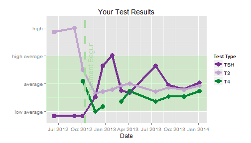

--- 
title       : How am I doing?
subtitle    : a webapp for patients with Graves' disease
author      : Liz Supinski
job         : Coursera/JHU Developing Data Products
framework   : io2012        # {io2012, html5slides, shower, dzslides, ...}
highlighter : highlight.js  # {highlight.js, prettify, highlight}
hitheme     : tomorrow      # 
widgets     : [mathjax, quiz]            # {mathjax, quiz, bootstrap}
mode        : selfcontained # {standalone, draft}
knit        : slidify::knit2slides

--- bg:url(assets/img/md_pa5.png)

### Introduction  

Graves' disease is a type of primary hyperthyroidism caused by autoimmunity. 

Patients with Graves' require frequent thyroid testing and lifelong followup
even after successful treatment as relapse rates are high, as is hypothyroidism
induced by treatment.

In the U.S., the prevalence of electronic medical records means that patients
often receive test results directly from the lab, without explanation by a
healthcare provider.

This application is intended to let patients visualize their test data, see if
they are responding to treatment as expected and identify when they need to seek
medical advice. It also provides a tool for doctors and patients to discuss
results of treatment.

---

### Patient Input

Here is an example of the kind of data a patient might receive from the 
laboratory. This patient was tentatively diagnosed in August 2012 and began treatment
Oct 14, 2012.

<!-- html table generated in R 3.1.1 by xtable 1.7-4 package -->
<!-- Sat Sep 20 10:45:05 2014 -->
<table border=1>
<tr> <th>  </th> <th> Date </th> <th> TSH </th> <th> FreeT4 </th> <th> FreeT3 </th>  </tr>
  <tr> <td align="right"> 1 </td> <td> 4/31/2012 </td> <td>  </td> <td align="right"> 1.60 </td> <td align="right"> 4.60 </td> </tr>
  <tr> <td align="right"> 2 </td> <td> 6/13/2012 </td> <td> &lt;.005 </td> <td align="right">  </td> <td align="right"> 5.80 </td> </tr>
  <tr> <td align="right"> 3 </td> <td> 9/2/2012 </td> <td> &lt;.005 </td> <td align="right">  </td> <td align="right"> 6.00 </td> </tr>
  <tr> <td align="right"> 4 </td> <td> 10/5/2012 </td> <td> 0.006 </td> <td align="right"> 1.30 </td> <td align="right"> 3.90 </td> </tr>
  <tr> <td align="right"> 5 </td> <td> 11/23/2012 </td> <td> 1.71 </td> <td align="right"> 0.70 </td> <td align="right"> 2.70 </td> </tr>
  <tr> <td align="right"> 6 </td> <td> 12/21/2012 </td> <td> 4.57 </td> <td align="right"> 0.80 </td> <td align="right"> 2.80 </td> </tr>
  <tr> <td align="right"> 7 </td> <td> 1/27/2013 </td> <td> 5.54 </td> <td align="right">  </td> <td align="right"> 2.90 </td> </tr>
  <tr> <td align="right"> 8 </td> <td> 3/4/2013 </td> <td> 2.31 </td> <td align="right"> 0.90 </td> <td align="right"> 3.10 </td> </tr>
  <tr> <td align="right"> 9 </td> <td> 4/7/2013 </td> <td> 2.13 </td> <td align="right"> 1.10 </td> <td align="right"> 3.20 </td> </tr>
  <tr> <td align="right"> 10 </td> <td> 7/16/2013 </td> <td> 4.59 </td> <td align="right"> 0.90 </td> <td align="right"> 2.80 </td> </tr>
  <tr> <td align="right"> 11 </td> <td> 9/5/2013 </td> <td> 2.8 </td> <td align="right"> 1.00 </td> <td align="right"> 3.00 </td> </tr>
  <tr> <td align="right"> 12 </td> <td> 11/4/2013 </td> <td> 2.47 </td> <td align="right"> 1.00 </td> <td align="right"> 2.90 </td> </tr>
  <tr> <td align="right"> 13 </td> <td> 1/5/2014 </td> <td> 3.04 </td> <td align="right"> 1.10 </td> <td align="right"> 3.10 </td> </tr>
   </table>

--- &twocol

### Interface example

*** =left

*** =right

Patients enter their data on the left side of the screen and can use a tabbed interface to see either instructions, some basic information about Graves disease, a table of the data as they enter it or a graph of the entered data.

--- bg:url(assets/img/smile4.png)

### Behind the scenes 

The application normalizes the test scores that patient report so that they can
all be displayed on the same graph. A numeric axis is replaced with a green-
colored band indicating normal range. (For these tests, like virtually all 
medical tests, normal range is $\pm 2 $ standard deviations.) 

We hope that this application will provide a valuable tool for patients and 
physicians to discuss the course of treatment and progress, and reassure patients
about test data between doctor's visits. 
